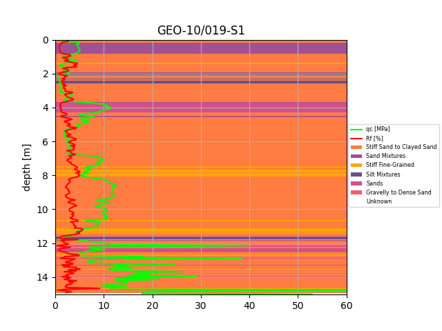

# Cone Penetration Test Analyzer

## Description
This app facilitates the analysis of cone penetration tests such that the soil stratigraphy 
can be identified. The implemented methodology is the updated Robertson method (2010).

## Features
* Uploading of JSON files with probe measurements to a server
* Classification into the ten soil behaviour types (SBTs)
* Determine the number of layers as well as the thickest layer, optionally within a given SBT
* Graph functionality to display the SBTs and probe measurements of interest together (see graph below)
* Retrieval of probe measurements from the geoserver of Database Underground Flanders (DOV) 
  within a given geographical area

## Installation
1. Clone the repository: 
    ```
   git clone https://github.com/GuBij/cpt-app.git
   ```
2. Navigate to the project folder:
   ```
   cd cpt-app
   ```
3. Install the dependencies
   ```
   poetry install
   ```
4. Start the application
    ```
   poetry run uvicorn app.main:app
   ```
5. The application should be locally accessible at http://127.0.0.1:8000/ 

## Use
Once the app is installed and running by following the steps in the previous section, the graph under the last section Demo can be reproduced 
as follows:
1. Upload the file `opdracht2.json` from the folder `input_files` to the server: go to http://127.0.0.1:8000/probes/ 
   and use the displayed HTML form.
2. After the JSON file is uploaded, the directory where it's stored should be displayed on the screen: 
   `uploaded_files\\opdracht2.json`
3. Paste the following address into the browser: http://127.0.0.1:8000/probes/graph/uploaded_files//opdracht2
4. The graph should now be visible in the browser.

The documentation and the Swagger UI is served at http://127.0.0.1:8000/docs

## Requirements
- Python 3.10+
- Uvicorn 0.38.0
- fastAPI 0.119.0
- Pydantic 2.12.3
- python-multipart 0.0.20
- pandas 2.1.2+
- matplotlib 3.8+
- lxml 6.0.2
- beautifoulsoup4 4.12+
- shapely 2.0+
- requests 2.31+

## License
This project is licenced under the BSD 3-Clause License - see the [LICENSE](LICENSE) file for details.

## Demo
The graph below displays the different soil behaviour types occurring in the soil as well as the measured cone resistance qc (green)
and the friction ratio Rf (red). The classification is based on the probe measurements in the file `input_files/opdracht2.json`.


